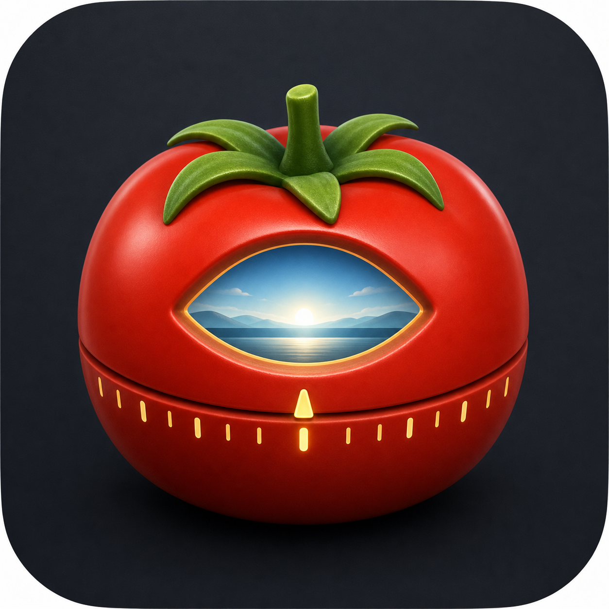

# Focus Breaks

A small Windows desktop Pomodoro timer for long computer days. It runs a 20-minute focus timer by default, then covers the screen with a full-screen break overlay for 5 minutes so you actually look away from the display.

The app is intentionally simple: start, pause, reset, skip the current phase, and adjust focus/break durations.



## Features

- 20/5 focus and break cycle by default
- Full-screen break overlay on every monitor
- Configurable focus and break durations
- Pause, reset, and skip controls
- Optional sound signal
- Settings saved in `%APPDATA%\FocusBreaks\settings.json`
- Windows `.exe` builds with PyInstaller

## Run From Source

```powershell
python -m pip install -r requirements.txt
python src\focus_breaks\main.py
```

## Build Windows EXE

```powershell
python -m pip install -r requirements-build.txt
powershell -ExecutionPolicy Bypass -File .\scripts\build-windows.ps1
```

The build script writes local artifacts to `release/`. That folder is ignored by git and is meant for GitHub Releases, not source commits.

## Self-Sign Windows EXE

```powershell
powershell -ExecutionPolicy Bypass -File .\scripts\self-sign-windows.ps1
```

## Signing Note

The first release can be signed with a self-signed Authenticode certificate. That proves the file has not changed after signing, but it does not carry Microsoft SmartScreen reputation and is not equivalent to a paid OV/EV code-signing certificate.

## License

MIT
